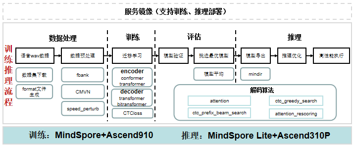

快速开始
========

项目介绍
~~~~~~~~

qinling-flyspeech是基于MindSpore开发的训练推理部署端到端语音识别算法工具包，是西北工业大学和华为在探索智能语音道路上的重要成果，中文名称为秦岭·翔语，本仓是秦岭·翔语项目中的ASR模型的代码，软硬件采用全国产华为昇腾全栈。

软件架构
~~~~~~~~

qinling-flyspeech主要分为两层，上层是提供直接训练、推理任务的脚本代码；下层是模型构建部分，主要分为配置、数据、模型以及推理部署等部分构成。

*注：虚线部分待实现*

   architecture

安装教程
~~~~~~~~

1. 安装CANN 5.0.4 前往昇腾社区下载安装包：
   https://www.hiascend.com/software/cann/commercial 以arm +
   欧拉的系统配置为例( x86的系统请选择x86的包 ) 安装驱动：
   ./A800-9000-npu-driver_21.0.4_linux-aarch64.run –full 安装固件：
   ./A800-9000-npu-firmware_1.80.22.2.220.run –full 安装cann-toolkit包:
   ./Ascend-cann-toolkit_5.0.4_linux-aarch64.run –full

2. 这里是列表文本安装MindSpore 1.6.1版本
   前往MindSpore官网,按照教程安装对应版本即可，当前为1.6.1,链接如下:
   https://www.mindspore.cn/install

3. 安装requirements依赖 pip install -r requirements.txt

代码结构
~~~~~~~~

::

   qinling-flyspeech
   |—— config # 配置文件
   |    |—— asr # asr任务的配置文件
   |    |    |—— asr_config.yaml     # asr 基础配置文件
   |    |    |—— asr_conformer.yaml    # encoder为conformer结构的asr配置文件
   |    |    |—— asr_conformer_bidecoder.yaml    # decoder为bi_transfomer结构的asr配置文件
   |    |    |—— asr_transformer.yaml    # encoder为transfomer结构的asr配置文件
   |—— examples  # 示例
   |    |—— aishell # aishell数据集示例
   |    |    |—— one_stop_asr_predict.sh # asr单卡训练启动脚本
   |    |    |—— one_stop_distribute_asr_train.sh # asr多卡训练启动脚本
   |    |    |—— one_stop_standalone_asr_train.sh # asr单卡训练启动脚本
   |    |    |—— README.md
   |—— flyspeech # 核心代码
   |    |—— adapter # 配置以及modelarts适配相关文件
   |    |—— dataset # 数据处理
   |    |—— decode  # 语音识别推理解码
   |    |—— layers  # 模型构成层
   |    |—— transformer # transformer以及conformer结构实现
   |    |—— model   # 模型实现
   |    |—— utils   # 相关实例代码
   |—— infer # 推理代码
   |    |—— infer_ascend_c++ # ascend c++推理代码
   |    |—— infer_ascend_python # ascend python 推理代码
   |—— scripts  # 预训练模型及下游任务训练/推理启动脚本
   |    |—— asr  # ASR训练启动脚本
   |    |    |—— run_standalone_asr_train.sh # asr单卡训练启动脚本
   |    |    |—— run_distribute_asr_train.sh # asr多卡训练启动脚本
   |    |    |—— ... # 同上
   |    |—— predict # 推理启动脚本
   |    |    |—— ... # 同上
   |    |—— preprocess # 数据集下载及准备脚本（Aishell 数据集）
   |    |    |—— ... # 同上
   |    |—— tools # 数据集准备辅助脚本
   |    |    |—— ... # 同上
   |—— tools   # CER计算、模型导出等相关工具代码
   |—— asr_predict.py # asr推理代码
   |—— asr_train.py # asr训练代码
   |__ README.md

使用说明
~~~~~~~~

支持模型
^^^^^^^^

qinling-flyspeech支持encoder：transformer，conformer模型。

========== ================
模型类别   结构
========== ================
ASR        ASR-transformer
\          ASR-conformer
========== ================

FAQ
~~~

优先参考\ `ModelZoo
FAQ <https://gitee.com/mindspore/models#FAQ>`__\ 来查找一些常见的公共问题。

-  **Q：数据处理时出现\ ``No module named bz2``\ ？**

   **A**\ ：编译python时缺少bz2库，在安装bz2后重新编译python。

   ::

      sudo apt-get install libbz2-dev

-  **Q：训练时第一个epoch部分step耗时超过200s？**

   **A**\ ：由于采用分桶设置，在第一个epoch会针对不同bucket重新编译图，所以部分step会耗时长，属于正常现象。
